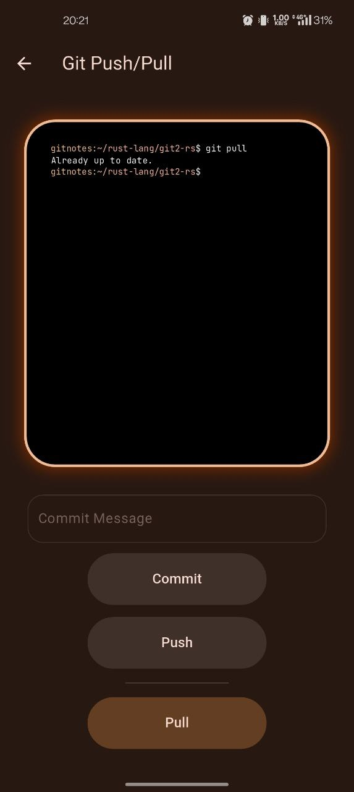
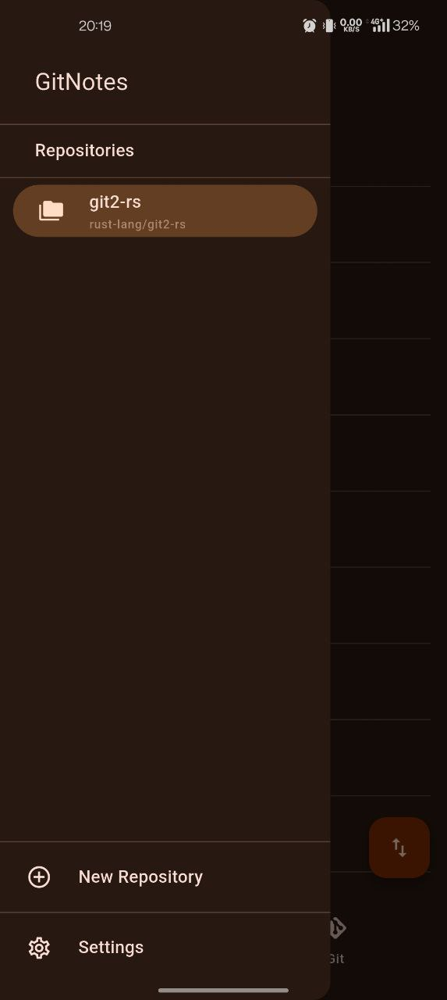
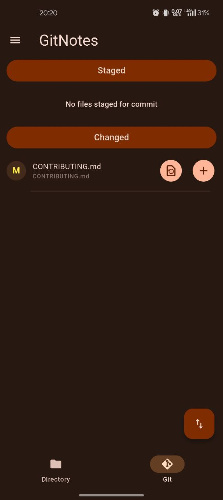
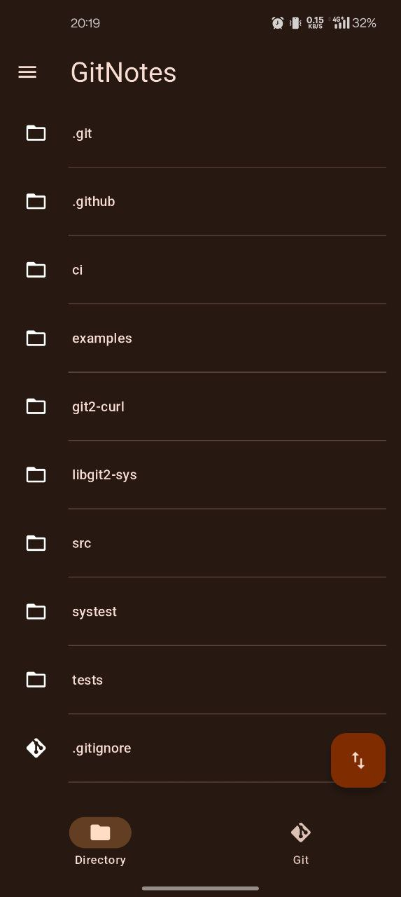
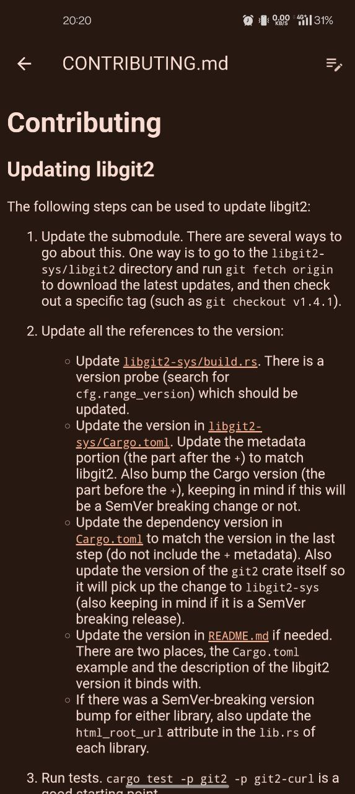
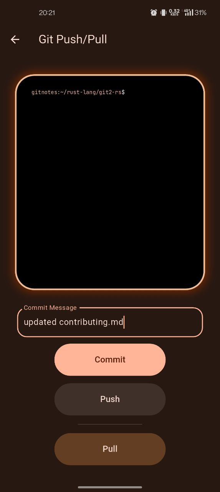
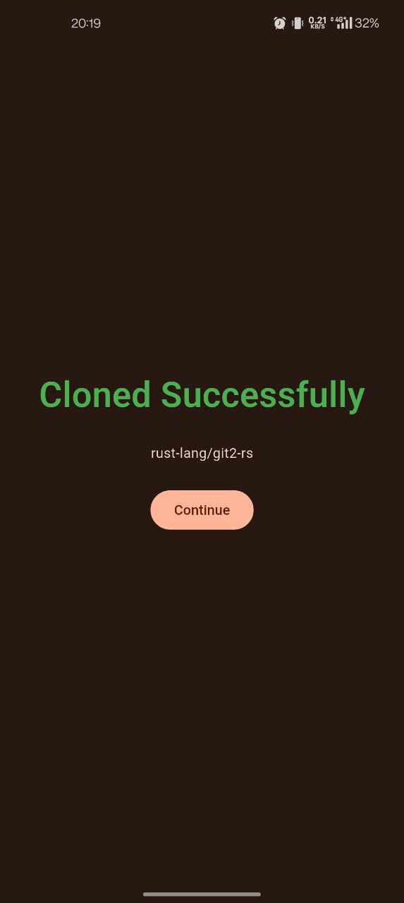
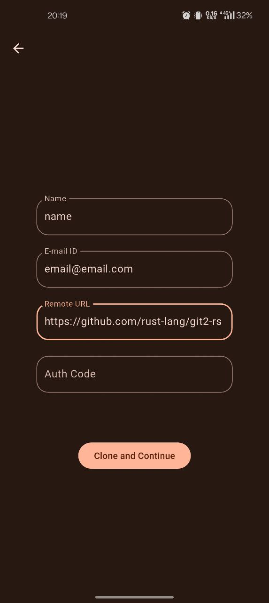

# GitNotes

A Markdown first notes app with git based syncing and version control.

## Screenshots

<p float="left">
  
  
  
  
</p>
<p float="left">
  
  
  
  
</p>

Please note: The app is still in its initial stages and the UI is *surely* going to change for the better. 

## Building Yourself

1. Make sure [Flutter](https://docs.flutter.dev/get-started/install) and the [Rust](https://www.rust-lang.org/tools/install) Toolchain is installed on your maching.
2. Ensure Android-Studio is installed.
3. Ensure `ANDROID_NDK_HOME` is set to the correct location.
4. Clone the repository.
5. Install rinf on your machine in the cloned directory using cargo

```
cargo install rinf@6.15.0
```

6. Run `rinf message` to generate messages between Dart and Rust.
7. Install relevant rust targets.
```
rustup target list | grep android | xargs rustup target install
```
8. Run `flutter build apk` to build the app.

## FAQs

1. Windows, Linux, MacOS, iOS and Web support?
    - **Desktop platforms**: Not anytime soon, also the need seems low as there are pretty robust applications that support markdown and git both (vscode!).
    - **Web**: Nope.
    - **iOS**: I would love to support it, but I don't have the resources (A Mac and an iPhone) to make it possible, nor do I have the kind of financials to pay up for the recurring fees that Apple charges. 

*More questions will be added here as they are asked.*

## Goals!

**Completed** - *These goals are in the app in there fullest and ready to use!.*

- Ability to clone and manipulate repositories in the external (or shared) storage.
- Git functions like clone, pull, add, commit, push.
- Managing and traversing multiple repositories.
- State management using BloC. (not user facing)

**Actively worked upon** - *These goals are actively recieving most of my time and efforts (parts may already be completed and implemented in the app).*

- A better UI with subtle animations and customizations.
- A Settings Page :)

**Research phase** - *These goals are still being examined and researched upon (It is possible they stay here for a while)*

- Using Git over SSH.
- Authorize app with GitHub and GitLab for easy cloning
- In app conflict management for pulling.
- Sharing files
- Converting and exporting md files in other formats (similar to how Joplin has).
- Add the app to F-droid

**Just an idea** - *These are just an idea or a shower thought :)*

- Support for handwriten notes.
- A graph view similar to Obsidian's

